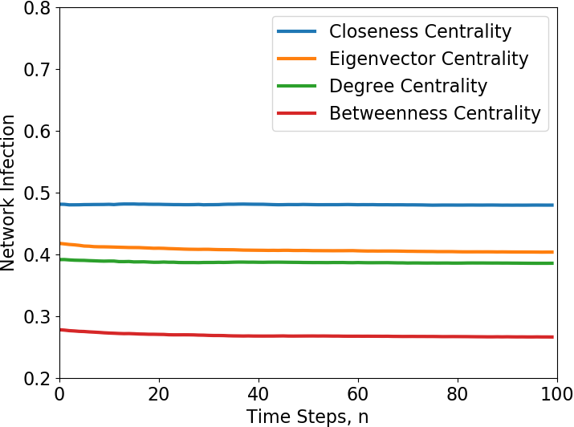
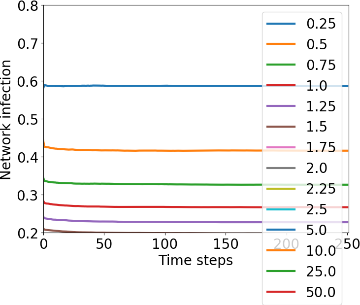
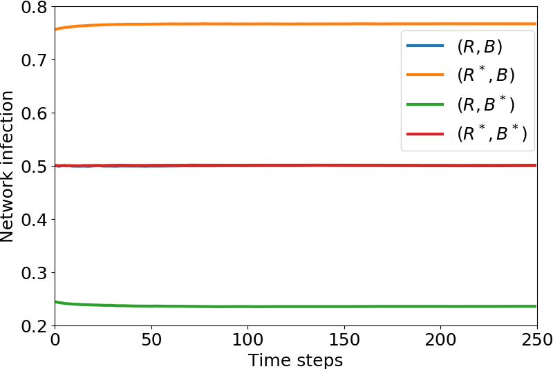

# Undergraduate Thesis

## Purpose

This repo is for work related to our 4th year thesis project on network contagion modelling.
We use the Polya contagion model to allow for easy computation and micro level modelling (vs. macro level in more 
commonly used techniques sych as SIS).
Specifically, we look at optimizing the initial distribution of balls to minimize the network infection at time N.

## Mathematical background

A node's neighbours are those connected to it by an edge.

A unique *super urn* (or super node) exists for each node, where the infection of the node is calculated based on 
the balls from itself and all of its neighbours.
Specifically, a node's infection is given by `total_red / (total_red + total_black)`, again, where 
`total_red` and `total_black` sums are taken over the super urn.

Network infection is defined as the average infection across all nodes in the network at each time step 
(note that this is a discrete time technique).

**NOTE**: it can be seen that the minimization of network infection is a non-linear optimization problem with 
a convex objective function.
See `model.analytical` for specific setup of objective and constraint functions.
It should also be noted that we are minimizing for N=1 (time 1) network infection for simplicity.

## Results

Generating random (ex. barabasi) and standard (ex. path, cycle, etc.) graphs.
Importing data, filtering, and generating a network (see below).

Run various heuristics in comparison to the optimal solution

Assess the impact of varying the allocation budget

Numerically confirms the existance of a nash equilibrium

see [`results`](results/) for more figures and [`data`](data/) for the raw data from the figure.

## Directories

| **Directory**  | **Summary** |
| ---------- | --- |
| data       | Contains raw data files and simulation data |
| execute    | Script to run a specific simulation or generate a figure |
| model      | This is where the base class and function files are kept (ex. network, nodes, etc.) |
| notes      | Notes on installation, and plotting (notes to self) so far |
| results    | This is where figures from simulations are saved |
| tests      | temp files to test concepts or snippets |
| scripts    | Bash scripts to facilitate installation of solvers |
| three_node | Small-scale simulation for a 3-node path graph |
| utilities  | Various utilities for plotting, io, statistics, etc. |

## Libraries used

For the project we used several libraries for convenience and efficiency, the main ones being `numpy`, 
matplotlib (specifically `pyplot`), `networkx`, and `pyomo`. 
Additionally, we used several open-source solvers with pyomo, specifically [`GLPK`](https://www.gnu.org/software/glpk/) 
(for initial testing, it doesn't support non-linear functions so was not used in the end), 
[`ipopt`](https://projects.coin-or.org/Ipopt) (delivered best results for us), and 
[`bonmin`](https://projects.coin-or.org/Bonmin) and [`couenne`](https://projects.coin-or.org/Couenne) 
to verify the results from `ipopt`.

## Data used

The [main data-set](https://openflights.org/data.html) used was from [OpenFlights](https://openflights.org/).
See the [data README](data/README.md) for more detailed information on the format.
